# Networking Demo

## Scenario

Proposed show case:

Given a set of IoT devices is not an uncommon scenario that they need to communicate with each other.
In this scenario, we will show how to set up a local network and run a local mosquitto broker on ESP32 devices.

### Network description

```mermaid
flowchart TB
    subgraph Network["Network (192.168.1.0/24)"]
        direction TB
        B[P4 Functional eval dev kit\n192.168.1.1]
        S[Ethernet Switch]
        N1[Node 1\n192.168.1.10]
        N2[Node 2\n192.168.1.11]
        BR[C5 Bridge to 5G Wireless\n192.168.1.2]

        B --- S
        S --- N1
        S --- N2
        S --- BR
    end
    
    subgraph Wireless["Wireless (192.168.1.0/24)"]
        direction TB
        W1[Node W1\n192.168.1.20]
        W2[Node W2\n192.168.1.21]
        
        BR --- W1
        BR --- W2
    end
    
    style Network fill:none,stroke:none
    style Wireless fill:none,stroke-dasharray: 5 5,stroke:#333
    style B fill:#FF7300,stroke:#333,stroke-width:2px
    style BR fill:#2F343F,stroke:#333,stroke-width:2px
    style N1 fill:#0064A7,stroke:#333,stroke-width:2px
    style N2 fill:#0064A7,stroke:#333,stroke-width:2px
    style N3 fill:#0064A7,stroke:#333,stroke-width:2px
    style W1 fill:#00AED9,stroke:#333,stroke-width:2px
    style W2 fill:#00AED9,stroke:#333,stroke-width:2px
    style W3 fill:#00AED9,stroke:#333,stroke-width:2px
```

## Required Hardware

- P4 Functional eval dev kit
- 3x ESP32c5 dev kit
- SPI Ethernet module
- 2x Ethernet capable module
- Simple Ethernet switch

- TODO: List cables and power source

## Software Components used

- mosquitto broker
- mqtt client
