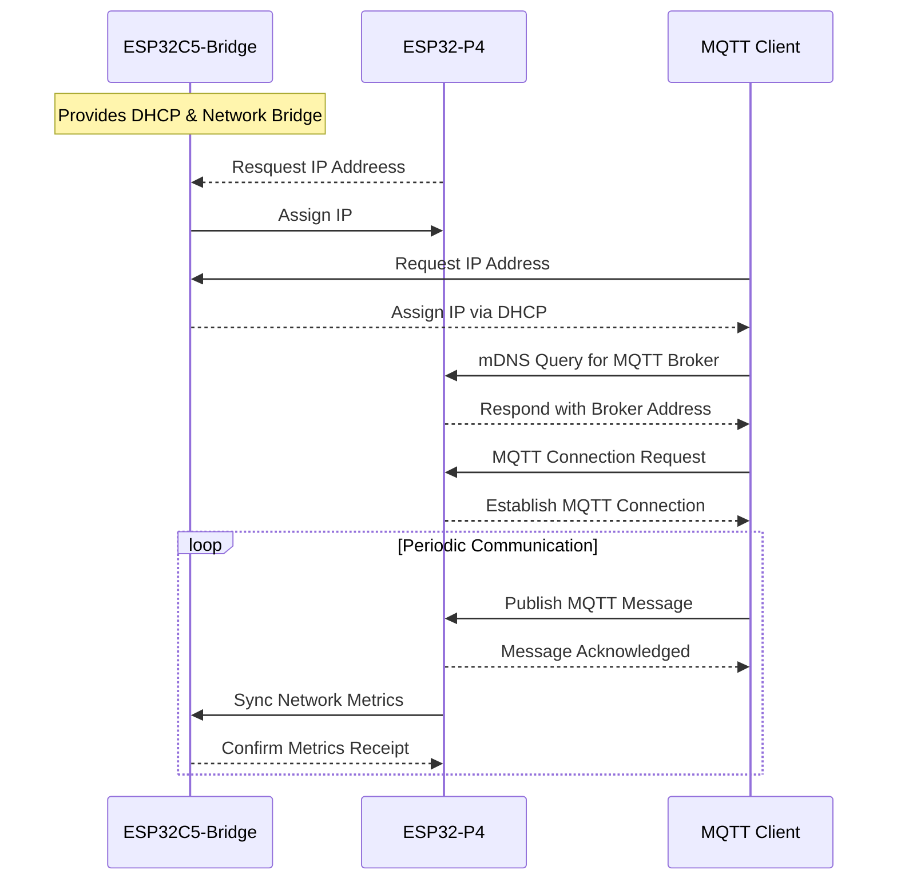

# ESP32 Zero Configuration Network Demo

This demonstration showcases a locally self-configuring network of ESP32 devices that automatically discover and communicate with each other without manual configuration. The system highlights the usage of mDNS (multicast DNS) service discovery in IoT applications and demonstrates how Espressif devices can be used to create robust, self-organizing networks.

## System Overview

Our demo consists of the following components:

1. **ESP32-P4** - Acts as an MQTT broker advertised via mDNS. This central component features a display showing real-time network statistics and demo information.

2. **ESP32-C5** - Serves as a network bridge between Ethernet and 5GHz Wi-Fi, functioning as an access point with integrated DHCP services. We leverage 5GHz capabilities of ESP32-C5 Wifi.

3. **MQTT Clients** - Automatically discover the broker address using mDNS queries and establish connections to the P4 broker.

## Base operation

### Network description

```mermaid
flowchart TB
    subgraph Network["Network (192.168.1.0/24)"]
        direction TB
        B[P4 Functional eval dev kit\n192.168.1.1]
        BR[C5 Bridge to 5G Wireless\n192.168.1.2]

        B --- BR
        
    end
    
    subgraph Wireless["Wireless (192.168.1.0/24)"]
        direction TB
        W1[Node W1\n192.168.1.20]
        
        BR --- W1
    end
    
    style Network fill:none,stroke:none
    style Wireless fill:none,stroke-dasharray: 5 5,stroke:#333
    style B fill:#FF7300,stroke:#333,stroke-width:2px
    style BR fill:#2F343F,stroke:#333,stroke-width:2px
    style W1 fill:#00AED9,stroke:#333,stroke-width:2px

```

## Key Features

- **Zero Configuration** - Devices automatically discover each other using mDNS protocol
- **Distributed Architecture** - Clear separation of roles between devices
- **Automatic Failover** - System resilience through service discovery
- **Real-time Monitoring** - P4 display provides system status and metrics
- **Bridged Connectivity** - Seamless integration of Ethernet and Wi-Fi networks

## Technical Implementation

The demo leverages several key technologies:

- **mDNS Service Discovery** - For automatic MQTT broker discovery
- **MQTT Protocol** - For efficient message passing between devices
- **ESP-IDF Framework** - Utilizing Espressif's development framework
- **Wi-Fi & Ethernet** - Hybrid networking approach with the ESP32-C5 as bridge

## Applications

This demonstration showcases technology applicable to:

- Smart home systems with zero-touch configuration
- Industrial IoT deployments requiring resilient communication
- Educational environments demonstrating network protocols
- Rapid prototyping scenarios where manual configuration is impractical
